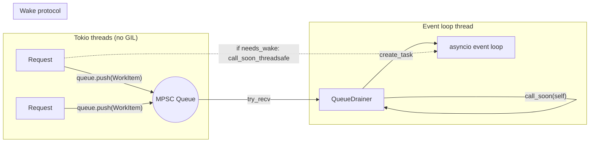

# Queue-Based Dispatch for Event Loop

## Summary

Replaced per-request `call_soon_threadsafe` with a lock-free MPSC queue (`QueueDrainer` pyclass singleton). Scheduling overhead dropped 95% (median 66µs → 3µs), GIL eliminated from hot path. Overall throughput unchanged — the bottleneck is asyncio event loop thread saturation, not the enqueue mechanism.

## Architecture

### Wake protocol

- `AtomicBool needs_wake`: `true` = drainer sleeping, `false` = drainer active
- Producer: `queue.push(item)`, then `if needs_wake.swap(false, AcqRel): call_soon_threadsafe(drainer)`
- Drainer: drains all → if empty, `needs_wake.store(true, Release)` → double-check drain → if still empty, sleep
- Under sustained load: zero `call_soon_threadsafe` calls, zero GIL on tokio threads

## Benchmark Results

| Metric | Before | After | Change |
|--------|--------|-------|--------|
| echo req/s (2w, 100c) | 3,017 | 3,029 | flat |
| schedule median | 66 µs | 3 µs | **-95%** |
| schedule P99 | 2,828 µs | 2,130 µs | -25% |
| queue_push median | — | 0 µs | new |
| GIL on hot path | yes (47µs median) | no | eliminated |
| dispatch_buffered await | 24,620 µs | 27,103 µs | +10% (noise) |

## Why Throughput Didn't Improve

The 3.9ms `cross_thread_pickup` measured in the baseline was **event loop thread contention** (requests queued behind each other), not callback queue overhead. The scheduling path was only 0.3% of total request time. The real bottleneck is:

1. **~4ms event loop queue depth** — 100 concurrent requests serialized on one asyncio thread
2. **~9ms asyncio task scheduling overhead** — `create_task` + `add_done_callback` overhead vs uvicorn's native I/O dispatch
3. **FastAPI internals** — routing, middleware, Pydantic serialization saturate the event loop

## Key Insight: `schedule_with` Cannot Use `Send + 'static`

The plan assumed `schedule_with` could delegate to `schedule_deferred` (requiring `Send + 'static`). This failed because `asgi_dispatch.rs:137` captures `&InboundRequest` which contains a `dyn Stream` (not `Sync`, so `&InboundRequest` is not `Send`). Solution: `schedule_with` builds the coroutine on the calling thread under GIL, then pushes the resulting `Py<PyAny>` through the queue.

## Future Optimization Directions

1. **Eliminate event loop for sync handlers** (HIGH) — `spawn_blocking` on tokio, skip cross-thread hop entirely. Expected ~2x for sync handlers.
2. **Reduce asyncio task scheduling overhead** (MEDIUM) — custom awaitable that avoids `create_task` entirely.
3. **Native event loop I/O** (HIGH, COMPLEX) — have asyncio own the HTTP socket (like uvicorn). Parity expected but requires transport layer rearchitecture.

## Relevant Files

- `crates/framework/src/event_loop/queue.rs` — `WorkItem`, `QueueDrainer` pyclass, `CoroutineBuilder` type alias
- `crates/framework/src/event_loop/core.rs` — `EventLoop` struct gains `queue_tx`, `needs_wake`, `drainer_ref`; `install_drainer()` creates singleton on event loop thread
- `crates/framework/src/event_loop/handle.rs` — `EventLoopHandle` rewritten: `schedule_deferred` pushes to queue (no GIL), `wake_if_sleeping` for idle→active transition
- `crates/framework/src/event_loop/scheduling.rs` — `CoroutineScheduler` removed, `TaskCallback` kept
- `.plans/framework/v1/bench/one-flow/10-03-2026-post-analysis.md` — full benchmark analysis (gitignored)
- `.plans/framework/v1/bench/one-flow/10-03-2026-detailed-trace.md` — baseline trace data (gitignored)

## Notes

- The code is worth keeping despite no throughput gain: cleaner architecture, GIL-free hot path, foundation for future batch optimizations
- Commit: `1c5e389` on `experimentation/framework`
